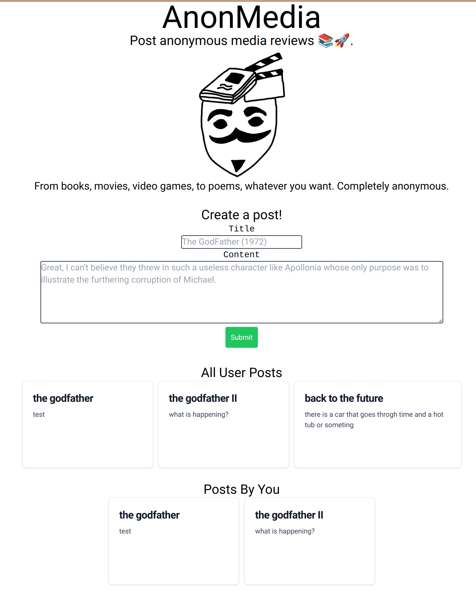

# AnonMedia

Post permanent, anonymous media reviews!

<p align="center">
   
</p>

> Not hosted anywhere.

Another deformed CRUD app that doesn't even support half of the CRUD operations.

---

## Tech Stack

React-based frontend <br>
Go/PostgreSQL-based backend

## Getting Started

Setup your environment variables in the `.env` files. Provided are two `.env_example` files that you can
very quickly change to be your `.env` files.

For development, you would need to run 3 things at once:

1. Frontend `cd frontend && npm start`
2. Backend service `cd backend && make watch`
3. Backend DB:

```
docker run --name anonMediaDB \
  -e POSTGRES_DB=anonmedia \
  -e POSTGRES_USER=anon \
  -e POSTGRES_PASSWORD=password1234 \
  -p 5432:5432 \
  -d postgres
```

For "pseudo-prod", you can run everything inside of docker containers with compose:

1. `./run.sh`
   > loads up your .env environment variables before running compose

Frontend is served on `localhost:3000`.
Docker containers have their main process's internal port mapped out to a corresponding host os network port.
I didn't choose to use any custom Docker virtual networks like a simple `bridge` network because it was just easier to
have the containers just bind to the host os network stack's ports.
